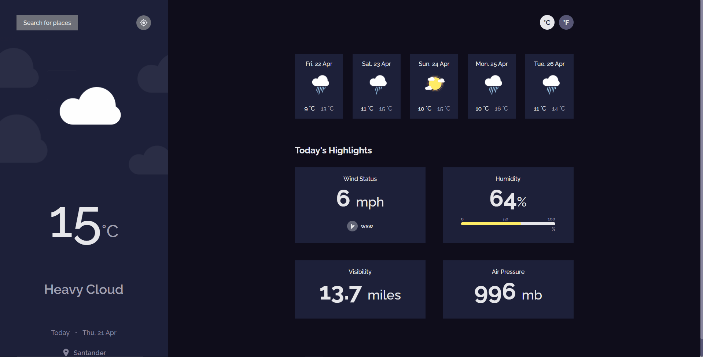
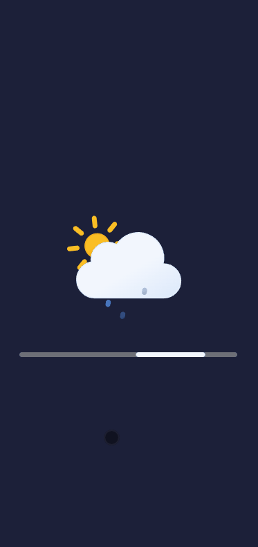

<h1 align="center">⛅ 𝗪𝗲𝗮𝘁𝗵𝗲𝗿 𝗔𝗽𝗽</h1>
<p align="center">
❗ Solution for a challenge from <a href="http://devchallenges.io" target="_blank">Devchallenges.io</a>
</p>

<div align="center">
  <a href="#links">Links</a>&nbsp;&nbsp;&nbsp;|&nbsp;&nbsp;&nbsp;
  <a href="#technologies">Technologies</a>&nbsp;&nbsp;&nbsp;|&nbsp;&nbsp;&nbsp;
  <a href="#how-to-use">How To Use</a>
</div>
<br />

<div>
  <p>🔎 <strong>About: </strong>See the weather in your city/state or anywhere in the world.</p>
</div>

<div>
  <h2>⚔️ 𝗧𝗵𝗲 𝗰𝗵𝗮𝗹𝗹𝗲𝗻𝗴𝗲</h2>
  <p>Users should be able to see or perform:</p>

  - [x] City weather by default, preferably current location
  - [x] Search by any city
  - [x] Weather of today and the next 5 days
  - [x] The date and location of the weather
  - [x] According to image for each type of weather
  - [x] The min and max degree each day
  - [x] Wind status and wind direction
  - [x] Humidity percentage
  - [x] Visibility indicator
  - [x] Request current location weather
  - [x] Convert temperature in Celsius to Fahrenheit
</div>

<div>
  <h2>⚙️ 𝗣𝗹𝘂𝘀</h2>
  <p>✔️ If the user rejects the current location request permission, the location will be fetched through the ip address.</p>
  <p>✔️ Search autocomplete.</p>
</div>

<div>
  <h2>🖥️ 𝗗𝗲𝘀𝗸𝘁𝗼𝗽</h2>
  
</div>

<div>
  <h2>📱 𝗠𝗼𝗯𝗶𝗹𝗲</h2>
  
</div>

<div>
  <h2 id="links">🔗 𝗟𝗶𝗻𝗸𝘀</h2>
  <p>
    🗔 Demo URL: <a href="https://weather-app-olive-tau.vercel.app/" target="_blank">Demo</a>
  </p>
  <p>
    💡 Solution: <a href="https://devchallenges.io/solutions/tRyVcyaCT9xYmoJ0UXOW" target="_blank">Solution</a>
  </p>
  <p>
    🗡️ Challenge: <a href="https://devchallenges.io/challenges/mM1UIenRhK808W8qmLWv" target="_blank">Challenge</a>
  </p>
</div>

<h2 id="technologies">⚡️ 𝗧𝗲𝗰𝗵𝗻𝗼𝗹𝗼𝗴𝗶𝗲𝘀</h2>

<ul>
  <li>ReactJS</li>
  <li>Typescript</li>
  <li>Styled components</li>
  <li>React icons</li>
  <li>React toastify</li>
</ul>

<h2>📡 𝗔𝗣𝗜𝘀 𝘂𝘀𝗲𝗱 𝗶𝗻 𝘁𝗵𝗲 𝗮𝗽𝗽𝗹𝗶𝗰𝗮𝘁𝗶𝗼𝗻</h2>

<ul>
  <li>
    <a 
      href="https://www.metaweather.com/api/" 
      target="_blank"
    >
      ☀️ MetaWeather 
    </a>
  </li>

  <li>
    <a 
      href="https://ipinfo.io/" 
      target="_blank"
    >
      🗄️ IpInfo
    </a>
  </li>
</ul>


<h2 id="how-to-use">📌 𝗛𝗼𝘄 𝗧𝗼 𝗨𝘀𝗲</h2>

```bash
# Clone this repository
$ git clone https://github.com/LeonardoYz/Weather-App.git

# Go into the repository
$ cd Weather-App

# Install dependencies
$ yarn install

# Run the application
$ yarn start
```